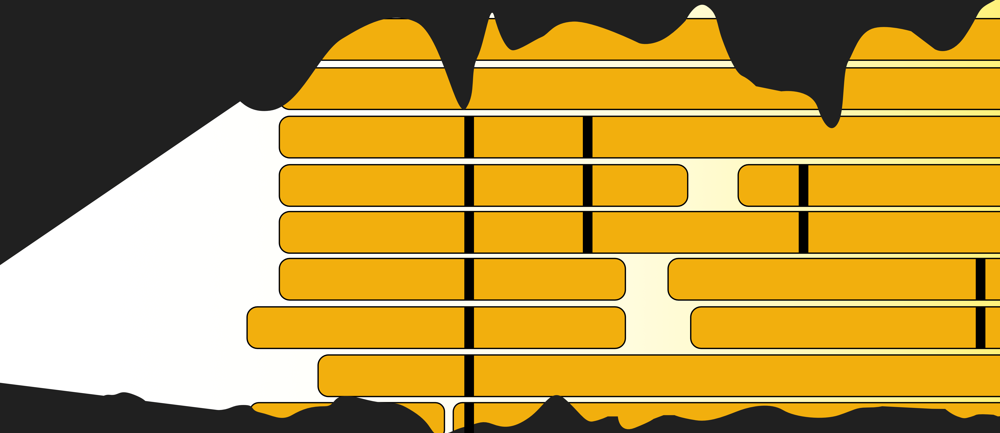

## MSAexplorer
_"Explore multiple sequence alignments with a simple python package."_ 



**DISCLAIMER:** This is a hobby project of mine. I re-implemented some of my old stuff and some new ideas, just to get it all under one roof. Hope it is useful for you. Contributions are highly welcome.

## Planned features

- class for annotations (*.gff, *.bed, *.gb)
- annotate MSA with annotation class (adjust positions)
- output to standard file formats
- easy to use plotting features
- unit tests

## Requirements

_Tried to make the requirements as minimal as possible._

- python >= 3.12
- numpy ~ 2.1.3

## Installation

Coming soon.

## Documentation

### The MSA class

```python
from msaexplorer import explore

# load MSA
msa = explore.MSA('path-to-msa')

# you can set the zoom range and the reference id
msa.zoom = (0, 1500)  # set zoom range
msa.reference_id = 'your_ref_id'  # set reference id, this is used by different functions (otherwise consensus is used)

# access MSA attributes
msa.alignment  # alignment as dictionary
msa.length  # alignment length
msa.aln_type  # type of the alignment

# explore MSAs, outputs are largely dictionaries, some of the function are only for DNA/RNA
msa.get_snps()  # function to call snps compared to ref (if set) or consensus
msa.get_consensus()  # calculate a consensus sequence
msa.get_conserved_orfs()  # get orfs (including internal) with conserved start and stop position. identity is also calculated.
msa.get_reference_coords()  # get alignment coordinates of the reference
msa.get_non_overlapping_conserved_orfs()  # get orfs that do not overlap, additional a min identity can be set

msa.calc_gc()  # calc gc content
msa.calc_entropy()  # calc shannons normalized entropy
msa.calc_coverage()  # calc coverage
msa.calc_length_stats()  # calculate length statitstics
msa.calc_percent_recovery()  # calculated recovery over reference/consensus sequence
msa.calc_identity_alignment()  # convert the alignment into a identity alignment 
msa.calc_similarity_alignment()  # convert the alignment into a similartity alignment based on different similarity matrices
msa.calc_character_frequencies()  # calculate observed character frequencies
msa.calc_pairwise_identity_matrix()  # calculate identity matrix
msa.calc_reverse_complement_alignment()  # convert alignment sequences to reverese complement
```