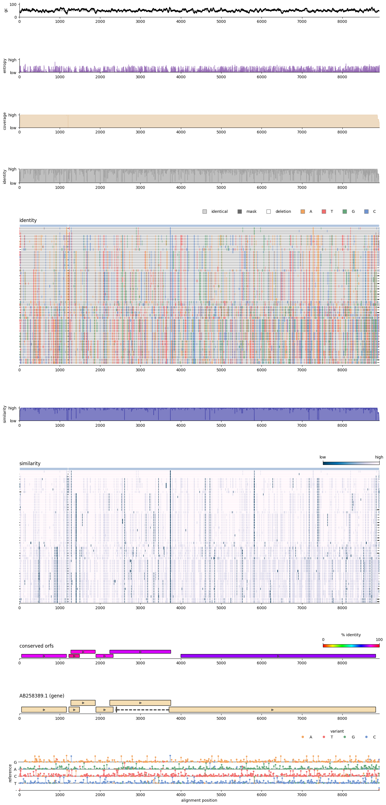

Introducing MSAexplorer, a simple python package and [shiny application](https://shiny.posit.co/py/) to analyse and plot multiple sequence alignments.
The main goal of the plotting features are to grasp the whole alignment and generate publication ready pdfs. Moreover, MSAexplorer
simplifies reading and analyses of multiple sequence alignments with minimal python syntax.

The serverless shiny app is automatically deployed to gihub pages via [shinylive](https://shiny.posit.co/py/docs/shinylive.html) and includes the current version of the master branch. All computation runs in your browser. MSAexplorer can handle any alignment size. However, the computation time increases with larger alignments. If your alignment is similar to my [examples](example_alignments/DNA.fasta), plotting will be near to instant on any modern cpu.

## Quick Installation

```bash
git clone https://github.com/jonas-fuchs/MSAexplorer
cd MSAexplorer
pip install -r requirements.txt
```
## [Serverless Shiny app](https://jonas-fuchs.github.io/MSAexplorer/shiny)


## [Python package API documentation](https://jonas-fuchs.github.io/MSAexplorer/docs/msaexplorer.html)

### [Exploration](https://jonas-fuchs.github.io/MSAexplorer/docs/msaexplorer/explore.html) 

### [Plotting](https://jonas-fuchs.github.io/MSAexplorer/docs/msaexplorer/draw.html) 

#### [Mayhem example _(lets just go nuts :bomb: )_](https://jonas-fuchs.github.io/MSAexplorer/docs/msaexplorer.html#plotting)


