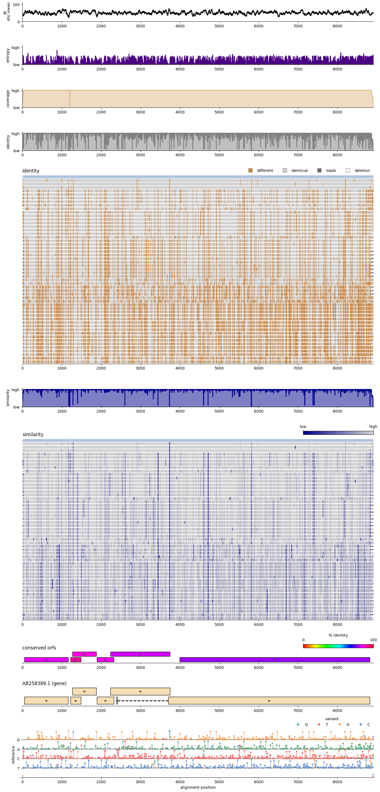

## Installation

MSAexplorer can be used as a simple python extension.

```bash
git clone https://github.com/jonas-fuchs/MSAexplorer
cd MSAexplorer
pip install .
```

## Usage
### [Full API documentation](https://jonas-fuchs.github.io/MSAexplorer/)

### Alignment exploration

Read in multiple sequence alignment and compute several statistics.
```python
from msaexplorer import explore

# load MSA
msa = explore.MSA('example_alignments/BoDV.aln')
annotation = explore.Annotation(msa, 'example_alignments/AB258389.gff3')

# you can set the zoom range and the reference id
msa.zoom = (0, 1500)
msa.reference_id = 'your_ref_id'

msa.calc_pairwise_identity_matrix()
```


### Alignment drawing

Besides exploring alignments, you can plot them with the `draw` module.

**Example:**

```python
import matplotlib.pyplot as plt
from msaexplorer import explore
from msaexplorer import draw

aln = explore.MSA("example_alignments/BoDV.aln", reference_id=None, zoom_range=None)
aln.reference_id = list(aln.alignment.keys())[0]
fig, ax = plt.subplots(nrows=9, height_ratios=[0.2,0.2,0.2,0.2,2,0.2,2,0.2,0.5], sharex=False)

draw.stat_plot(aln, ax[0], "gc", rolling_average=20, line_color="black")
draw.stat_plot(aln, ax[1], stat_type="entropy", rolling_average=1, line_color="indigo")
draw.stat_plot(aln, ax[2], "coverage", rolling_average=1)
draw.stat_plot(aln, ax[3], stat_type="identity", rolling_average=1, line_color="grey")
draw.identity_alignment(aln, ax[4], show_gaps=False, show_mask=True, show_mismatches=True, reference_color='lightsteelblue', show_seq_names=False, show_ambiguities=True, fancy_gaps=True, show_x_label=False, show_legend=True, bbox_to_anchor=(1,1.05))
draw.stat_plot(aln, ax[5], stat_type="similarity", rolling_average=1, line_color="darkblue")
draw.similarity_alignment(aln, ax[6], fancy_gaps=True, show_gaps=True, matrix_type='TRANS', show_cbar=True, cbar_fraction=0.02,  show_x_label=False)
draw.orf_plot(aln, ax[7], cmap='hsv', non_overlapping_orfs=False, show_cbar=True, cbar_fraction=0.2, min_length=150)
draw.annotation_plot(aln, 'example_alignments/AB258389.gff3',  ax[8], feature_to_plot='gene', show_x_label=False)
draw.variant_plot(aln, ax[9], show_x_label=True, show_legend=True, bbox_to_anchor=(1,1.35))

fig.set_size_inches(14, 29)
fig.tight_layout()
plt.show()
```

**Will result in:**

