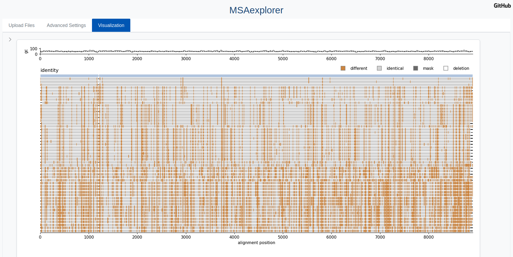

# Run as shiny app

Most of MSAexplorers features can also be accessed as a Shiny app.

## Installation

```bash
git clone https://github.com/jonas-fuchs/MSAexplorer
pip install -r requirements.txt
cd MSAexplorer
shiny run app.py
```

This will run the shiny app which can be accessed through your browser.

